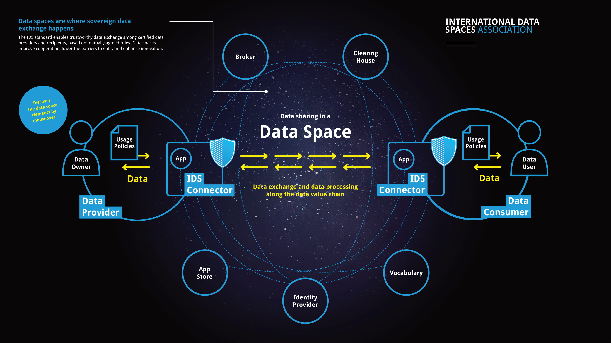

# The International Data Spaces Association on GitHub
The International Data Spaces Association aims at open, federated data ecosystems and marketplaces ensuring data sovereignty for the creator of the data. As depicted on the infographic below, the IDS standard enables trustworthy data exchange among certified dataproviders and recipients, based on mutually agreed rules. Data spaces improve cooperation, lower the barriers to entry and enhance innovation for the future of data economy.

## What is Available Here?
This is an umbrella repository which aims to guide you through the International Data Spaces Association (IDSA) on Github, by pointing you to the right source of information. We briefly provide an overview on available resources in this repository and beyond to support your journey building data spaces and sharing data in a secure and sovereign way. You can also see an overview of repositories [here](./overview_repositories.md) or if you are interested in terms widely being used in IDS ecosystem, you may check the [IDS Glossary in IDS-G](https://github.com/International-Data-Spaces-Association/IDS-G/tree/main/Glossary).

**If you are not a user of IDS Github yet**, please join us by clicking on the button below and submitting a request to participate. *The requests are processed within a maximum of two business days (in most cases, the invitations are sent within several hours).*

# Table of contents

-   What is Available Here?
    -   [IDS Reference Architecture Model (IDS RAM)](#IDS-RAM)
    -   [IDS-G](#IDS-G)
    -   [IDS Reference Testbed](#IDS-Reference-Testbed)
    -   [Minimum Viable Data Space](#Minimum-Viable-Data-Space)
    -   [IDS Deployment Scenarios](#IDS-Deployment-Scenarios)
    -   [IDS Portfolio of Building Blocks](#IDS-Portfolio-of-Building-Blocks)
    -   [IDS Graduation Scheme](#IDS-Graduation-Scheme)
-   [IDSA at a Glance](#IDSA-at-a-Glance)
-   [How to Contribute?](#How-to-Contribute?)
-   [Management of Releases & License](#Management-of-Releases-&-License)

## :blue_book: IDS Reference Architecture Model (IDS RAM) 
The [IDS RAM](https://github.com/International-Data-Spaces-Association/IDS-RAM_4_0) is the beating heart of the IDS — it comprises the standards for secure and sovereign data exchange, certification and governance for across Europe and around the world. It is the blueprint for trustworthy data-driven ecosystems that promote data-sharing.

Since the release of v4.0, IDS RAM is available on [Github](https://github.com/International-Data-Spaces-Association/IDS-RAM_4_0) and -as always- open for contributions. You are warmly invited to start contributing by checking the [contribution rules here](https://github.com/International-Data-Spaces-Association/IDS-RAM_4_0/blob/main/CONTRIBUTING.md) and/or [check the list of existing issues](https://github.com/International-Data-Spaces-Association/IDS-RAM_4_0/issues).

You may also find the [previous version (v3.0) here](IDS-Reference-Architecture-Model-3.0-2019.pdf) in PDF format.

## :globe_with_meridians: IDS-G 
The [IDS-G](https://github.com/International-Data-Spaces-Association/IDS-G) is the point of truth for specifications of the IDS and its components. It is public for everyone and contains the approved specifications that were confirmed by the IDS Technical Steering Committee (IDS-TSC) and the IDSA Working Groups. IDS-G publishes quarterly releases with new approvals by the Working Groups and the TSC.

Find the overview on the IDS resources and status of specifications in [**IDS-G** here on GitHub](https://github.com/International-Data-Spaces-Association/IDS-G)

As part of this repository, you can also find the [IDS Glossary of Terms](https://github.com/International-Data-Spaces-Association/IDS-G/tree/main/Glossary) 

You are invited to [create issues on IDS-G](https://github.com/International-Data-Spaces-Association/IDS-G/issues). The issues are tracked, approved and worked on in [IDS-G-pre](https://github.com/International-Data-Spaces-Association/IDS-G-pre) by IDSA members.

## ✔️IDS Reference Testbed 
[IDS Testbed](https://github.com/International-Data-Spaces-Association/IDS-testbed) is a setup with Open Source IDS components which can be used to verify that a component implements the IDS specifications for establishing connections and communication and thus, can work interoperable with all IDS components in the testbed setup. It can be used for component behaviour testing, interoperability testing against IDS components (Connector, DAPS, CA, Metadata Broker), preparation for IDS certification and a starting point for creation of data spaces. 

You can check the [IDS Reference Testbed repository](https://github.com/International-Data-Spaces-Association/IDS-testbed) for more information.

## 💊 Minimum Viable Data Space 
The Minimum Viable Data Space (MVDS) is a combination of components to initiate a data space with just enough features to be usable for secure and sovereign data exchange, as specified by IDSA. It aims to facilitate the work of experimenters by shortening the implementation time (by avoiding lengthy details that would slow down the first release). MVDS allows them to start with a first working version (where secure and sovereign data exchange is granted), where the development team can iterate, identify and respond to the assumptions about the requirements of the data space.

To start experimenting with a MVDS, you can start with the setup explained [on this page](https://github.com/International-Data-Spaces-Association/IDS-testbed/blob/master/minimum-viable-data-space/MVDS.md) of IDS Reference Testbed repository.

## ✍️ IDS Deployment Scenarios 
[IDS Deployment Scenarios](https://github.com/International-Data-Spaces-Association/IDS-Deployment-Scenarios) is the repository where deployment examples from various domains and cases are listed. It acts as a library of information listing different deployment alternatives applied by IDS projects and can be used as a great source of inspiration, prior to your implementation process.

If your IDS implementation is either on Pilot or Live stage, you are warmly invited to apply with your IDS Deployment Scenario via the [Data Space Radar form](https://forms.office.com/Pages/ResponsePage.aspx?id=NNZGs_usx0K9RPFVfuibG3WVHeFvj2hHgjU7ZCgshUhUMExMOTdCWDNMSERJTjlIUlRKMVc0QTUxMCQlQCN0PWcu). 

## :black_square_button: IDS-Portfolio-of-Building-Blocks 
[IDS Portfolio of Building Blocks](https://github.com/International-Data-Spaces-Association/IDS-Portfolio-of-Building-Blocks) is the repository that provides an overview of IDS Building Blocks that are available as open source projects, including the [projects qualified via IDS Graduation Scheme](https://github.com/International-Data-Spaces-Association/idsa/blob/main/graduation_scheme/Projects.md) and others that contain pieces to initiate a data space.

If you would like to have a project added into the IDS Portfolio of Building Blocks, please [use this template](https://github.com/International-Data-Spaces-Association/IDS-Portfolio-of-Building-Blocks/issues/new?assignees=&labels=&template=building-block-addition-request.md&title=) to create an issue in the repository. 

## 🥚 IDS Graduation Scheme 
IDS Graduation Scheme is the set of rules, processes and criteria to evaluate the maturity level of a IDS-compliant component. 

You can find the latest version of [IDS Graduation Scheme here](https://github.com/International-Data-Spaces-Association/idsa/tree/main/graduation_scheme) and check this [one pager](https://github.com/International-Data-Spaces-Association/idsa/blob/main/graduation_scheme/IDSA-Sandbox-Application.pdf) as a starting point to understand how you can apply to it with your project. If you already have a IDS-related project you can quickly initiate your application via [this form](https://internationaldataspaces.org/sandbox-application/).

## :book: Knowledge Base 
The IDS Knowledge Base consists of a step-by-step guide on [How to Build Data Spaces](./how-to-build-data-spaces/README.md) providing insights to support your way to build Data Spaces on the foundation of IDS. This community-driven knowledge base is a place to gather and share knowledge. New contributions are always very welcome. If you are interested in sharing your experiences with the community, it is recommended to start with the [contribution guidelines](/CONTRIBUTING.md).

:triangular_flag_on_post: Part of the IDS Knowledge Base is also offered as part of IDSA Website [docs.internationaldataspaces.org](https://docs.internationaldataspaces.org/knowledge-base/) where you can find lean and brief information on the most popular topics about IDS technologies. 

#
## IDSA AT A GLANCE 
You may read the Executive Summary of the IDSA [here](https://www.internationaldataspaces.org/publications/sharing-data-while-keeping-data-ownership-the-potential-of-ids-for-the-data-economy/) and check the [goals](GOALS.md) of the association.

[IDSA Website](https://internationaldataspaces.org/) | [LinkedIn](https://www.linkedin.com/company/international-data-spaces-association/mycompany/) | [Twitter](https://twitter.com/ids_association) | [YouTube](https://www.youtube.com/channel/UC9PsQnKgreCmj-F6Kea5QRg) 

[Most Important Documents from IDSA](https://internationaldataspaces.org/publications/most-important-documents/)

[Benefits and Advantages of Becoming a Member of IDSA](https://internationaldataspaces.org/we/become-a-member/)
#

## How to Contribute to IDS Assets on Github? 
You are warmly invited to contribute to the IDSA work here. While some aspects of the IDSA work is limited to IDSA members, most of the work here on GitHub is open for everybody to use and to contribute. You can always create change requests as issues on the repositories below: 

| You Can Contribute to | By | Rules are Available in
| ----------- | ----------- | ----------- |
| [IDSA Main Repository (this repo)](https://github.com/International-Data-Spaces-Association/idsa), [IDS Knowledge Base](https://github.com/International-Data-Spaces-Association/idsa/tree/main/how-to-build-data-spaces), [IDS Graduation Scheme](https://github.com/International-Data-Spaces-Association/idsa/tree/main/graduation_scheme) | [Creating an Issue](https://github.com/International-Data-Spaces-Association/idsa/issues/new/choose) | [Contribution Guidelines](https://github.com/International-Data-Spaces-Association/idsa/blob/main/CONTRIBUTING.md)
| [IDS Reference Architecture Model](https://github.com/International-Data-Spaces-Association/IDS-RAM_4_0) | [Creating an Issue](https://github.com/International-Data-Spaces-Association/IDS-RAM_4_0/issues/new)| [Contribution Guidelines](https://github.com/International-Data-Spaces-Association/IDS-RAM_4_0/blob/main/CONTRIBUTING.md)
| [IDS-G](https://github.com/International-Data-Spaces-Association/IDS-G) | [Creating an Issue](https://github.com/International-Data-Spaces-Association/IDS-G/issues/new)| [Contribution Guidelines](https://github.com/International-Data-Spaces-Association/IDS-G/blob/main/CONTRIBUTING.md)
| [IDS Reference Testbed](https://github.com/International-Data-Spaces-Association/IDS-testbed) | [Creating an Issue](https://github.com/International-Data-Spaces-Association/IDS-testbed/issues/new)| [Contribution Guidelines](https://github.com/International-Data-Spaces-Association/IDS-testbed/blob/master/CONTRIBUTING.md)
| [IDS Deployment Scenarios](https://github.com/International-Data-Spaces-Association/IDS-Deployment-Scenarios) | [Applying with a Deployment Scenario](https://forms.office.com/Pages/ResponsePage.aspx?id=NNZGs_usx0K9RPFVfuibG3WVHeFvj2hHgjU7ZCgshUhUMExMOTdCWDNMSERJTjlIUlRKMVc0QTUxMCQlQCN0PWcu) or [Creating an Issue](https://github.com/International-Data-Spaces-Association/IDS-Deployment-Scenarios/issues/new)| [Contribution Guidelines](https://github.com/International-Data-Spaces-Association/IDS-Deployment-Scenarios/blob/main/CONTRIBUTING.md)

## Management of IDSA Releases 
The [IDS-RAM](https://github.com/International-Data-Spaces-Association/IDS-RAM_4_0) and specifications on [IDS-G](https://github.com/International-Data-Spaces-Association/IDS-G) are governed and managed by the IDSA and its members, through the bodies of the association. The main bodies are the IDSA Working Groups. Details on the management of IDSA releases are described in the [IDS-G Handbook](https://github.com/International-Data-Spaces-Association/IDS-G/blob/main/Handbook/README.md).

Please be also aware of our [Code of Conduct](../CODE_OF_CONDUCT.md).

## License
[CC-BY 4.0](/LICENSE.md) © International Data Spaces Association e.V.

