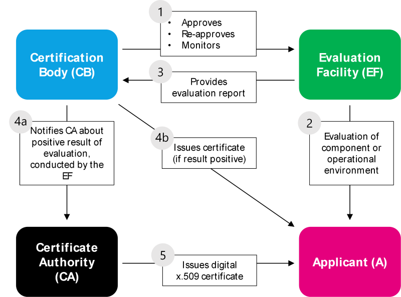

## 5. Get Certified

The Certification of the International Data Space is of fundamental importance for IDS and one of its core components. Certification in general provides a very high degree of transparency. This transparency is achieved by making the requirements for the auditee and the auditors and the complete certification process available for public. The transparency is also key for the main goal of certification: Trust. Trust is the basis for a successful collaboration between partners, in business as well as in social life. Due to the importance of collaboration for the IDS, certification works as an enabler for business and use cases. Collaboration is the basis for the IDS itself and therefore, it is necessary to establish trust by certification between the partners in IDS.

Certification is providing this trust by ensuring the security for everyone in a transparent way. Security is and will always be relative, but certification defines a standardized level for security related to technical and organizational aspects. The IDS needs this trust through certification. Therefore, IDS Certification is tailormade for
the specific IDS context. This IDS Certification is compatible with commonly used security standards like [ISO 27001](https://en.wikipedia.org/wiki/ISO/IEC_27001) and [IEC 62443](https://en.wikipedia.org/wiki/IEC_62443), so existing documentations and setups for the achieved certifications can be re-used in IDS. This minimizes the effort during IDS certification process for the organizations involved.

### Certification of components
The component certification required for participating in the IDS serves the purpose of proving the trustworthiness of the developed components by evaluating the fulfilment of functional, security-relevant, and procedural requirements. An IDS component can fulfil three different security profiles (Base, Trust, Trust+), and will be indicated at the issued certificate. The certificate is the most important prerequisite for a component being used within the IDS.

### Certification of operational environment
The operational environment certification serves the purpose of proving the trustworthiness of the participating organizations by evaluating the fulfilment of several technical and procedural requirements for the operational environment. Also here, there are several security profiles an operational environment can fulfil and will be indicated at the issued certificate. For the organization, the resulting certificate is the most important prerequisite for access to the IDS.

#
The entire certification process consists of three steps as shown on the leaflet ["How to Get IDS Certified?"](https://internationaldataspaces.org/wp-content/uploads/dlm_uploads/Leaflet-How-to-get-IDS_certified.pdf)

1. We will consult you on the process and help you find the perfect partner.
2. Onboarding session with your Evaluation Facility. You will get your individual audit road map.
3. The Evaluation Facility will start the audit process and collaborate with you on collecting all necessary documents and information.
#

You can get more information via [IDSA Website](https://internationaldataspaces.org/use/certification/)
If you need more details (on services, costs,  or looking forward to initiate the certification process, you can contact IDSA Head Office via email: (supportoffice@internationaldataspaces.org)

---

### Who is involved and why?

### Applicant
The Applicant (mostly an organization) wants to get into an IDS, therefore he needs to make sure that the components he uses as well as his operational environment are IDS compliant and therefore certified. He can approach either the IDSA directly in order to find a suitable Evaluation Facility that carry out the assessment in order get certified, or he can find an EF on its own. The Applicant will need to provide all necessary documents and access to relevant material to the Evaluation Facility to get assessed and evaluated. In the end, the Applicant will receive an evaluation report from the EF with which he can request the certificate at the Certification Body (CB). In case of a positive result, the Applicant gets an IDS certificate from the CB and additionally, the x.509 certificate from the Certificate Authority (CA). 

### Evaluation Facility
The Evaluation Facility carries out the actual assessment of the Applicant’s components or operational environment. In most cases, other EFs perform the evaluation of the components than those of the Operational Environment. To become an EF, the organization must go through the IDS approval process for IDS Evaluation Facilities. This process is carried out by the IDS Certification Body and needs to be repeated after 2 years. To ensure that the Evaluation Facilities incorporate all changes concerning the certification, ad-hoc audits may take place, organizes by the CB.   

### Certification Body
The Certification Body is responsible for:

•	The approval and re-approval of the Evaluation Facilities

•	The monitoring of the evaluation carried out by the EF on a regular basis (ensuring that EF is testing on latest requirements, etc.)

•	Issuing the certificate to the Applicant

•	Notifying the CA that the digital certificate can be issued to the Applicant

The first Certification Body will be run within the IDSA, as a separated section, assigning an external expert to carry out the approval of EF and other technical related tasks.

### Certificate Authority
The Certificate Authority (CA) will be notified by the CB if a positive evaluation of the Applicant took place and issues the digital x.509 certificate to the Applicant directly. 

