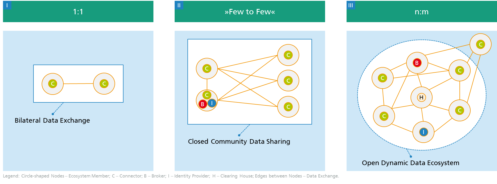

# Documentation
## Introduction
The following content is meant to support everyone who wants to either build IDS components or implement and/or contribute to the existing open source components.
It will link you to relevant sources and will provide guidance on your way. 

Since this documentation relies on the IDS expertise and experience of everyone involved, please feel free **to contribute to it.** 
As soon as you notice that you are missing information at a certain point, you can:
+ Open an issue that points to this topic. 
+ Add a section, link, or whatever would fill this gap.
+ Have a look at the open issues and try to fix them.

If you are interested in contributing to this document, please check the detailed information on [how to contribute](/documentation/CONTRIBUTING.md) to this documentation.

# Building Data Spaces

[Gather Knowledge](/documentation/README.md#1-gather-knowledge)
[Design Your Architecture](/documentation/README.md#2-design-your-architecture)
[Develop Your Components](/documentation/README.md#3-develop-your-components)
[Integrate Your Components](/documentation/README.md#4-integrate-your-components)
[Get Certified](/documentation/README.md#5-get-certified)
[Start Sharing Your Data in a Sovereign Way](/documentation/README.md#6-start-sharing-your-data-in-a-sovereign-way)

On the sections below, you will find the appropriate resources and links that provide technical information/documentation on each step for developing data spaces. As is known, every development journey is an individual one. So your starting point may differ based on your knowledge, as well as the steps you have to take. Please feel free to check the forthcoming chapters to find relevant information and documentation.

## 1. Gather Knowledge

## 2. Design Your Architecture

## 3. Develop Your Components

## 4. Integrate Your Components

## 5. Get Certified

## 6. Start Sharing Your Data in a Sovereign Way

Since every journey is individual, the starting point may differ as well as the steps you have to take. 
In general, your journey may contain the following stages: 
+ Gather knowledge
+ Design your architecture
+ Develop your components
+ Integrate your components
+ Prepare for certification
+ Get IDS certified
+ Register to get on board
+ Start sharing

### Use Open Source Software
[start with the data space connector](https://international-data-spaces-association.github.io/DataspaceConnector/)

## Gather knowledge
This stage is meant to sharpen your comprehension of IDS technologies and core ideas. It is linking you to every source that could be of help while learning about the IDS. (E.g. IDS Reference Architecture, IDS Rulebook, Current IDS standard, IDS Handshake and Communication Guide)

### GOALS OF THE INTERNATIONAL DATA SPACES
Data sovereignty is a central aspect of the International Data
Spaces. It can be defined as a natural person’s or corporate
entity’s capability of being entirely self-determined with regard
to its data. The International Data Spaces initiative proposes
a Reference Architecture Model for this particular capability
and related aspects, including requirements for secure
and trusted data exchange in business ecosystems.

+ **TRUST:** Trust is the basis of the International Data Spaces. Each participant is evaluated and certified before being granted access to the trusted business ecosystem.

+ **SECURITY AND DATA SOVEREIGNTY:** All components of the International Data Spaces rely on state-of-the-art security measures. Apart from architectural specifications, security is mainly ensured by the evaluation and certification of each technical component used in the International Data Spaces. In line with the central aspect of ensuring data sovereignty, a data owner in the International Data Spaces attaches usage restriction information to their data before it is transferred to a data consumer. To use the data, the data consumer must fully accept the data owner’s usage policy.

+ **ECOSYSTEM OF DATA:** The architecture of the International
                         Data Spaces does not require central data storage capabilities.
                         Instead, it pursues the idea of decentralization
                         of data storage, which means that data physically remains
                         with the respective data owner until it is transferred to a
                         trusted party. This approach requires a comprehensive description
                         of each data source and the value and usability
                         of data for other companies, combined with the ability to
                         integrate domain-specific data vocabularies. In addition,
                         brokers in the ecosystem provide services for real-time
                         data search.

+ **STANDARDIZED INTEROPERABILITY:** The International
                                     Data Spaces Connector, being a central component of the
                                     architecture, is implemented in different variants and can
                                     be acquired from different vendors. Nevertheless, each
                                     Connector is able to communicate with any other Connector
                                     (or other technical component) in the ecosystem of the
                                     International Data Space.

+ **VALUE ADDING APPS:** The International Data Spaces allows
                         to inject apps into the IDS Connectors in order to
                         provide services on top of data exchange processes. This
                         includes services for data processing, data format alignment,
                         and data exchange protocols, for example. Furthermore,
                         data analytics services can be provided by remote
                         execution of algorithms.

+ **DATA MARKETS:** The International Data Space enables the
                    creation of novel, data-driven services that make use of
                    data apps. It also fosters new business models for these
                    services by providing clearing mechanisms and billing
                    functions, and by creating domain-specific broker solutions
                    and marketplaces. In addition, the International Data
                    Spaces provides templates and other methodological support
                    for participants to use when specifying usage restriction
                    information and requesting legal information.

All research and development activities, as well as all activities
with regard to standardization, are driven by the
following guidelines:

+ **OPEN DEVELOPMENT PROCESS:** The International Data
                                Spaces Association is a non-profit organization institutionalized
                                under the German law of associations. Every organization
                                is invited to participate, as long as it adheres to the
                                common principles of work.

+ **RE-USE OF EXISTING TECHNOLOGIES:** Inter-organizational
                                       information systems, data interoperability, and information
                                       security are well-established fields of research and
                                       development, with plenty of technologies available in the
                                       market. The work of the International Data Spaces initiative
                                       is guided by the idea not to “reinvent the wheel”, but to
                                       use existing technologies (e.g., from the open-source domain)
                                       and standards (e.g., semantic standards of the W3C)
                                       to the extent possible.

+ **CONTRIBUTION TO STANDARDIZATION:** Aiming at establishing
                                       an international standard itself, the International
                                       Data Spaces initiative supports the idea of standardized architecture
                                       stacks.
                                       

### International Data Spaces Association
**TODO**: Describe IDSA, Goals, Link to "Become Member"

### How to start
Currently, IDS does not yet have an overarching existing ecosystem. Until now, mainly use cases between individual companies have been addressed
In the following diagram, these are located in evolutionary stage **I**.
In the meantime, use cases of evolution stage **II** are becoming increasingly established. The [Mobility Data Space](https://www.mobility-data-space.de/) and [Catena-X](https://www.handelsblatt.com/27129464.html) are particularly worthy of mention here, as are other [IDS Communities](https://internationaldataspaces.org/make/communities/) and [Projects](https://internationaldataspaces.org/make/projects/).

(Boris Otto, 2020)

On the IDSA website some use cases are described, which can be used as a guideline:
[https://internationaldataspaces.org/make/use-cases-overview/](https://internationaldataspaces.org/make/use-cases-overview/ )

**TODO**: Describe N:M Ecosystems from figure; Address use case development; Security Level

### Further Documents
**IDS Reference Architecture Model (RAM)** – This is an introductory document to the IDS architecture. It describes the goals, the structure, and the key elements of the architectural set-up of the IDS and offers a first glance at the practical application and context in which the IDS is used. Link to the document: https://internationaldataspaces.org/wp-content/uploads/IDS-Reference-Architecture-Model-3.0-2019.pdf

**Visual Overview of the IDS** – Here you can find a visual representation of the IDS architecture that helps you and your business to understand the basic setup of the IDS. Link to the document: https://internationaldataspaces.org/wp-content/uploads/dlm_uploads/IDSA-Infografik-English.pdf

**IDS Standard (DIN SPEC 27070)** – The DIN SPEC 27070 is a confidential document that specifies the technical requirements and the reference architecture of a Security Gateway for the exchange of industry data and services. Based on the principles of data sovereignty, the Security Gateway facilitates secure exchange of data and allows providing and using trustworthy data services. Link to request access to the document: https://internationaldataspaces.org/din-spec-27070/

**IDS and GAIA-X Position Paper** – The European initiative GAIA-X and the International Data Spaces share the vision of proliferating data sovereignty in a trusted data ecosystem. Nevertheless, some main differences exist. This position paper explains the relation of the International Data Spaces Reference Architecture Model and the principles and architecture of the European Imitative GAIA-X. Link to the document: https://internationaldataspaces.org/wp-content/uploads/IDSA-Position-Paper-GAIA-X-and-IDS.pdf

**IDSA Rulebook** – This document is meant for businesses and individuals who are building or using data-driven business models. This rulebook outlines a common governance framework and specifies the functional, technical, operational, and legal agreements to operate securely in the IDS. Link to the document: https://internationaldataspaces.org/wp-content/uploads/IDSA-White-Paper-IDSA-Rule-Book.pdf

**IDS Glossary** – In this glossary, the most important terms of the IDS, the services, and tools are defined (e.g., Clearing House, Data Provider, Data Sovereignty). Link to the glossary: https://github.com/International-Data-Spaces-Association/IDS-G/blob/master/glossary/README.md#certification-authority

**IDS Use Case Overview** – The purpose of this document is to provide interested parties with an overview of the practical application of the IDS architecture in various industries. The use cases which are gathered in this document are real-life examples of IDS industry partners and include a short problem statement, description of the targets, results, and benefits. Link to the document: https://internationaldataspaces.org/wp-content/uploads/dlm_uploads/Use-Case-Brochure_2019.pdf

**New Business Models for Data Spaces Grounded in Data Sovereignty** - This paper applies business frameworks and methods to the IDS perspective and gives some concrete use-case examples of early adopters for governance, participants, and support service providers. Link to the document: https://internationaldataspaces.org/wp-content/uploads/IDSA-Position-Paper-New-Business-Models-sneak-preview-version.pdf

**IDS Handshake** – This document, referred to as the IDS Handshake, details the actual steps of the data exchange process between participants in the IDS. It highlights the mandatory and optional steps that are needed to establish a trustworthy connection. To access this document, you must be registered in JIVE under https://internationaldataspaces.org/we/get-access-to-jive/. Link to the document: https://industrialdataspace.jiveon.com/docs/DOC-1817#jive_content_id_Motivation

**IDS Communication Guide** – This document describes how the interfaces of the individual components are defined and, above all, implemented. This results in a very precise description of the interfaces of individual components. To access this document, you must be registered in JIVE under https://internationaldataspaces.org/we/get-access-to-jive/. Link to the document: https://industrialdataspace.jiveon.com/docs/DOC-2524

**IDS Message Description** - This document lists all IDS message types along with a descripton of the role of each message type. The messages are categorized in the three main IDS message categories: Request, Response, and Notification messages. Link to the document: https://htmlpreview.github.io/?https://github.com/IndustrialDataSpace/InformationModel/blob/feature/message_taxonomy_description/model/communication/Message_Description.htm.

**IDS Appstore and App Development** - This document provides an overview of how IDS Data Apps and IDS App Store operate, along with their interaction with other IDS components. To access this document, you must be registered in JIVE under https://internationaldataspaces.org/we/get-access-to-jive/. Link to the document: https://industrialdataspace.jiveon.com/docs/DOC-2604

**Data Usage Control in IDS** Data Usage Control is the specification and enforcement of restrictions regulating what must (not) happen to data. It is an extension to traditional Access Control. This document provides necessary information about Data Usage Control in IDS. Link to the document: [# Data Sovereignty: Updated Position Paper on Data Usage Control in the IDS](https://internationaldataspaces.org/data-sovereignty-updated-position-paper-on-data-usage-control-in-the-ids/)

### IDS Trainings

**IDS Basic Training “Data sovereignty and International Data Spaces”** – This hands-on training is designed for professionals from various industries, IT and software development specialists, and executive managers who would like to understand the structure of the IDS architecture, its technologies, services, and roles. The training lasts one full day and is offered upon request by the Fraunhofer Academy in Dortmund, Germany. Link to the training: https://www.dataspaces.fraunhofer.de/en/referenzen/seminare/basic-training.html

**IDS Software Workshop** – During this two-day workshop, the participants will get to know the functions and configurations of various IDS components (e.g., provider and consumer connector, IDS Broker, IDS Identity Provider). The workshop is targeted at developers, software experts, and architects. Dates and costs are available upon request. Link to the training: https://www.dataspaces.fraunhofer.de/en/referenzen/seminare/software_workshop.html

## Setup your IDS Connector in your system landscape

**TODO** Link to DSC, Trusted Connector, TRUE Connector

---
From here on old content

---

## Design your architecture
This stage is meant to support you in designing the architecture of your components. It provides relevant links and explains the context around it. 
## Develop your components
You can either build IDS components from scratch by using existing resources as a template, or you can reuse existing open source components available on the [IDS Git-Hub repository](https://github.com/International-Data-Spaces-Association). Already at this stage, you must ensure that the necessary requirements for a later, successful certification are met.
+ IDS Connector Architecture 
+ Metadata Broker
+ Infomodel
+ Identity Management (DAPS, ParIS, CA)
+ App Store
+ Vocabulary Provider
+ Clearing House

### Data Usage Control
The Usage Control related libraries and applications are listed as follows:
- **Policy-Library** This is the IDS policy model in Java which can read and interpret the IDS Usage Policy Language as JSON-LD. Link to the code: [IDS Policy Library](https://github.com/International-Data-Spaces-Association/Policy-Library)
- **Mydata-Translator** This Java library uses the Policy-Library and translates an IDS usage policy to a MY DATA Control Technologies policy. Link to the code: [MY DATA Control Technologies Translator](https://github.com/International-Data-Spaces-Association/Mydata-Translator)
- **IDS-PAP** This is a web application with Java back end that provides a Material-UI to support the users to specify their IDS policies. Link to the code: [IDS Policy Administration Point (PAP)](https://github.com/International-Data-Spaces-Association/IDS-PAP)
- **Usage-Control-App** This a Usage Control prototype application which uses MY DATA Control Technologies to manage and enforce IDS policies. The app can be called by a [Camel Interceptor](https://camel.apache.org/components/3.4.x/eips/intercept.html)  or can be called directly to integrate Usage Control into the IDS Connectors. Link to the code: [IDS Usage Control Application](https://github.com/International-Data-Spaces-Association/Usage-Control-App)

## Integrate your components
+ Integration of IDS into existing systems
## Prepare for certification
+ IDS Plugfest 
+ IDS Testbeds 
+ SQS Integration Test Camp
+ IDS Lab 
+ Sick testbed
+ nicos AG testbed 
+ Fraunhofer workshop IDS_ready
## Get IDS certified
Once you have chosen your preferred evaluation facility, you can start to get your components and operational environemnt certified. Here, you will find relevant information on how to start the process. 
## Register to get on board
You will need to gather all necessary documents and provide them to the on-boarding facility, which will introduce you to the targeted data space. 
## Start sharing
Here, you will get hints on how to set for instance usage contrains.
