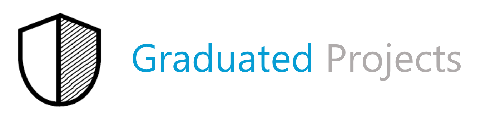

## Projects in IDSA Open Source Landscape 

This page provides an overview of all projects that are part of the IDSA Graduation Scheme, with newest projects at the top.

:triangular_flag_on_post: To apply with your project, you may [click here](https://internationaldataspaces.org/open-source-application-form/) to apply via the forms on IDSA Website.

:triangular_flag_on_post: And [here](https://github.com/International-Data-Spaces-Association/idsa/tree/main/graduation_scheme) you can check the IDSA Graduation Scheme.

---

Sandbox projects are “early stage,” this covers the following examples:

- New projects that are designed to extend one or more IDSA projects with functionality or interoperability libraries.
- Independent projects that fit the IDSA mission and provide the potential for a novel approach to existing functional areas (or are an attempt to meet an unfulfilled need).
- Projects commissioned or sanctioned by the IDSA, including initial code for IDSA WG collaborations, and “experimental” projects.
- Any project that realistically intends to join IDSA Incubation in future and wishes to lay the foundations for that.

## :arrow_forward: FIWARE TRUE Connector 
(IDS Sandbox project since 09.02.2022)

The FIWARE TRUE Connector enables the trusted data exchange in order to be an active part of an IDS Ecosystem, a virtual data space leveraging existing standards and technologies, as well as governance models well-accepted in the data economy, to facilitate secure and standardized data exchange and data linkage in a trusted business ecosystem. The integration of existing FIWARE ecosystems is guaranteed by the dedicated Data APP, enabling the IDS-based interaction in a plug-and-play way.

:octocat: [Project Repository](https://github.com/International-Data-Spaces-Association/true-connector)

:link: [Project Website](https://www.eng.it/en/case-studies/true-connector-per-facilitare-la-condivisione-di-dati-in-gaiax)

:page_with_curl: [Contributing Guidelines](https://github.com/eclipse-dataspaceconnector/DataSpaceConnector/blob/main/CONTRIBUTING.md)

:memo: [Application Document](./Sandbox_Reviews/Applications/true-connector.md)

---

## :arrow_forward: Eclipse Dataspace Connector
(IDS Sandbox project since 02.02.2022)

Whatever the individual setup is — on-premises bare-metal, different cloud vendors, hybrid, even single end-user machines — the EDC can be customized to work within any environment at scale. The connector’s added value is achieved through the separation of control and data plane, which enables a modular and thereby customizable way to build dataspaces. Due to common interfaces and mapping of existing standards, the connector adds capabilities of contract negotiating and policy handling in an interoperable manner. As an open source project hosted by the Eclipse Foundation, it provides a growing list of modules for many widely-deployed cloud environments “out-of-the-box” and can easily be extended for more customized environments, while avoiding any intellectual property rights (IPR) headaches.

:octocat: [Project Repository](https://github.com/eclipse-dataspaceconnector/DataSpaceConnector)

:link: [Project Website](https://projects.eclipse.org/projects/technology.dataspaceconnector) 

:page_with_curl: [Contributing Guidelines](https://github.com/eclipse-dataspaceconnector/DataSpaceConnector/blob/main/CONTRIBUTING.md)

:memo: [Application Document](./Sandbox_Reviews/Applications/eclipse-dataspace-connector.md)

---

Incubating projects have proven their compatibility (based on IDS Certification), reliability, vision and mission.

Currently, there are no incubated projects in IDSA Open Source landscape. 

---

Graduated projects signal the highest level of maturity for an IDSA project. They have achieved a broad acceptance and adoption in data spaces.

Currently, there are no graduated projects in IDSA Open Source landscape. 
