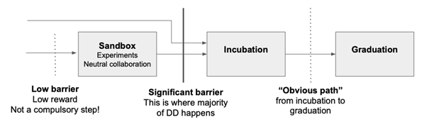
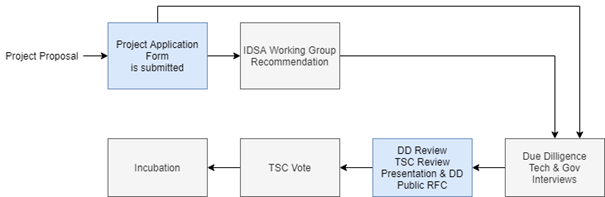
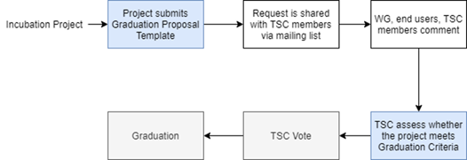

# IDSA Graduation Scheme v1.0

## Purpose of the Document
The [IDS standard on data sovereignty](https://github.com/International-Data-Spaces-Association/IDS-G) should be distributed and used everywhere, where data sovereignty is applied. Therefore, it should be easy to apply and be designed in a usable way. The IDSA graduation process shall provide a transparent way to provide an overview of the Building Blocks that are available. At the same time, it shall open the IDSA developments to the contributors to Open Source Building Blocks. 

The IDSA Graduation Scheme is based on the Cloud Native Computing Foundation (CNCF) project life cycle process (https://github.com/cncf/toc/blob/main/process/README.md). 
 
Please find addional information also on the [IDSA Homepage](https://internationaldataspaces.org/make/open-source/).

## Project Stages

### Sandbox Stage
The IDSA Sandbox has four goals:
- Encourage public visibility of experiments or other early work that can add value to the IDSA mission and build the ingredients of a successful Incubation-level project.
- Facilitate alignment with existing projects if (and only if) this is desired.
- Nurture projects (e.g., by IDSA Head Office and IDSA member support).
- Remove possible legal and governance obstacles to adoption and contribution by ensuring all projects adhere to IDSA legal, [code of conduct](Code_of_Conduct.md), and [IP policy requirements](IP_Policy.md).

When we say that Sandbox projects are “early stage,” this covers the following examples:
-	New projects that are designed to extend one or more IDSA projects with functionality or interoperability libraries. 
-	Independent projects that fit the IDSA mission and provide the potential for a novel approach to existing functional areas (or are an attempt to meet an unfulfilled need).
-	Projects commissioned or sanctioned by the IDSA, including initial code for IDSA WG collaborations, and “experimental” projects.
-	Any project that realistically intends to join IDSA Incubation in future and wishes to lay the foundations for that.

### Incubating Stage
Incubating projects have proven their compatibility (based on IDS Certification), reliability, vision and mission.

### Graduation Stage
Graduated projects signal the highest level of maturity for an IDSA project. They have achieved a broad acceptance and adoption in data spaces. 
 
 

## Submission/Application Processes

This governance policy sets forth the proposal process for projects to be accepted into the [International Data Spaces Association](https://internationaldataspaces.org/) \(“IDSA”\). The process is the same for both existing projects which seek to move into the IDSA, and new projects to be formed within the IDSA.
 
### Sandbox Application Process

Projects apply to join the Sandbox by submitting the form [here](https://internationaldataspaces.org/sandbox-application/), which fills in a row on a publicly-visible spreadsheet, but will include
- Required: link to project on GitHub or other public source repository
- Optional: link to project website, if it exists
- Required: checkbox to ensure submitter understands the project license would need to follow the [IDSA IP Policy](./IP_Policy.md) if accepted
-	Required: checkbox to ensure submitter understands they would be giving the project trademarks and accounts to IDSA if accepted
-	Required: a short description of alignment to IDSA
-	Required: comparison with similar projects
-	Required: link to the public roadmap (This could be in any format - documentation, GitHub issues, project boards etc. The requirement is simply that there should be some public documentation of the future direction and goals of the project)
-	Required: link to contribution guidelines
-	Required: link to Code of Conduct
-	Optional: statement on alignment with existing IDSA projects 
-	Optional: link to a pre-existing presentation (slides / video) 
-	IDSA staff check submissions for administrative criteria, and advise project maintainers if they don’t currently meet these criteria:
-	Compliance with IP policy
-	Project website meets IDSA Guidelines
-	Code of Conduct exist
-	Contribution guidelines exist 
-	Public roadmap exists. 
-	The TSC review submissions once per quarter for the following criteria:
	-	Is the project a fit for the IDSA, in the TSC’s opinion? 
	-	Is the project’s roadmap in line with the goals of the IDSA? 
	-	Does the project appear to be on a good path to becoming well-governed and vendor-neutral? 

During this submission review, the TSC votes on each submission, and projects will be accepted by a simple majority vote of the TSC. In the event of rejection, we will indicate which of these criteria the TSC did not believe were met. Projects are welcome to address feedback and submit again in future. Unless advised otherwise, projects should not submit again for six months. 
-	Sandbox projects remain subject to the [Annual Review process](./Sandbox_Annual_Review.md).

### Incubation Process

All exceptions (and "no" outcomes) are handled by the TSC.

 
Figure 3 1: From Sandbox to Incubation Steps

#### Project Proposal

Incubation proposed through a [submission form](https://internationaldataspaces.org/incubation-application/).

The status of outstanding Incubation proposals is reported on a monthly basis in the TSC public meeting. This highlights projects looking for sponsorship, and provides a check-in on DD progress for sponsored projects.

A potential sponsor will support the DD process and can indicate that they are interested but don’t have capacity to work on DD at this time, to set a project’s expectations.

The TSC may agree that the project does not (yet) meet the Incubation requirements and give feedback on why this is the case. If the project is not already in the IDSA, the TSC may suggest that project apply for Sandbox instead.

If a TSC Incubation Sponsor has not stepped forward within two months after the proposal PR is submitted, projects may request that their project proposal is discussed at a forthcoming TSC meeting by adding it to the [Working Doc](). The outcome of this is discussion is either that a sponsor steps forward, or that the TSC votes to admit the project to Sandbox, or the proposal is rejected (projects may reapply after six months). If, even after all those steps, a sponsor does not step forward, the proposal is rejected.

DD will usually involve a presentation to an IDSA Working Group (WG), but an interested WG is welcome to schedule a project presentation at any time. WG can discuss their recommendations or concerns about a project with their WG Chairs, if there isn’t already a TSC Incubation Sponsor in place.

Although it is not necessary, projects are allowed to informally reach out to TSC members for advice, including asking about potential sponsorship. TSC members should keep each other informed about these approaches so that we can avoid falling prey to "lobbying". There is a fine line between a project asking for help to make a successful application, and a project shopping around looking to pressurize a TSC member into sponsorship.

#### TSC Incubation Sponsor

TSC Incubation Sponsor is responsible for driving the process, and coordinating with WGs for review and input as they see fit. This is supported by the IDSA Head Office staff. 

IDSA Head Office staff is a point of contact for the project throughout the process to support. A project should name a clear project lead as main point of contact. 

TSC members may not sponsor a project for which they have a clear conflict of interest (for example, originating primarily from their organization). This doesn’t mean that they can’t have any involvement at all - for example, contributing pull requests, or being an end user of that project, can signal a healthy interest in and knowledge of a worthwhile project.

#### Due Diligence 2-3 months

- TSC Incubation Sponsor drives due diligence (see the [template](./due_diligence_reports/Due_Diligence_Project_Review_Template.md) and guidelines).
- TSC Incubation Sponsor can delegate DD work to IDSA WGs and/or other TSC members.
- Typically, DD includes a presentation to a IDSA WG, as identified by the TSC Sponsor. This step may be omitted if the TSC Sponsor feels there are readily-available and suitable presentations on video - for example, because the WG has already recently held a presentation. (We do not want unnecessary levels of process or bureaucracy to delay a widely-known and adopted project from joining the IDSA). TSC Sponsor has discretion to arrange alternatives (for example, arranging a Q&A session at a TSC meeting) to ensure there is ample opportunity to ask questions.
- TSC Incubation Sponsor can ask project maintainers to complete the DD template. (In practice project maintainers sometimes choose to make a start on this in advance of the official DD process, or even in advance of the initial proposal as it may help them ensure they meet all the requirements.) The TSC Incubation Sponsor should carefully review and ask questions about the DD as prepared by the project maintainers and may also call on WGs to help with this.
- IDSA staff does governance checks and legal DD checks.
- During DD some conversations may be held in private (e.g. user interviews where the user wishes to remain anonymous) and are documented using discretion.
- The TSC Incubation Sponsor confirms that project meets the Incubation requirements.
- TSC Incubation Sponsor determines when DD is “done”. DD documentation should then be on [GitHub](/due_diligence_reports/README.md), open to public comment on record.

#### Due Diligence review (2-6 weeks)
- TSC Incubation Sponsor announces on the TSC mailing list when the DD documents are available for public review and comment, which can take place on GitHub, the TSC mailing list, or at TSC public meetings.
- TSC Incubation sponsor decides when to call TSC vote, allowing at least two weeks for public comment before calling vote
- TSC vote up to 6 weeks
- TSC members assess whether project meets the IDSA incubation require-ments. Incubation criteria
- Projects get accepted to incubation via a 2/3 supermajority vote of the TSC.
- If the vote is not conclusive after 6 weeks, TSC chair may extend vote, or conclude that silence = abstain.

### Graduation Process
- Submit Graduation Proposal Template
- Project fills out and submits the [graduation proposal template in a form](https://internationaldataspaces.org/graduation-application/).
- The file containing the proposal should be located in github.
- The proposal addresses how the project has grown since incubation and any concerns from incubation DD in addition to the standard graduation requirements.
- TSC member kicks off two week period of time for public comment on the TSC mailing list
- The email should contain a link to the proposal pull request and incubation DD document.
- All WG, end users, TSC members, and community members are welcome to comment at this time on the mailing list.
- Historically, projects have done a TSC presentation as part of the graduation process. The TSC has gotten rid of the presentation requirement. Instead, if the TSC wants to have a deeper discussion about the project with the maintainers, they may schedule an ad hoc meeting to do so before the vote.

#### TSC vote

TSC members assess whether project meets the Graduation criteria
Projects must have a 2/3 supermajority vote of the TSC to graduate

*Notes*
-	TSC always has final decision
-	TSC doesn’t have to accept WG recommendation
-	Outcome may be “no” simply because sponsors don’t step forward within the timeframe
-	Outcome from TSC Triage or WG recommendation could be that we want to wait for some reason e.g. project backlogs; batching similar projects together. We should give the project an explanation and set time expectations in these cases.
-	All “no” outcomes and other exceptions are discussed by the TSC, and then with project and WG representatives. We will try to give feedback but it may simply be a lack of conviction in the project.
 

Figure 3 2: From Incubation to Graduation Steps

#### Project Proposal Requirements

Project proposals submitted to the IDSA can be written in [Markdown](https://www.markdownguide.org/), [AsciiDoc](http://asciidoc.org/), or [reStructuredText](http://docutils.sourceforge.net/rst.html) and must provide the following information to the best of your ability:
-	name of project (must be unique within IDSA)
-	project description (what it does, why it is valuable, origin and history)
-	statement on alignment with IDSA charter mission
-	comparison with similar projects (inside or outside the IDSA), including what differentiates this project
-	sponsor from TSC or head office (sponsor helps mentor projects)
-	preferred maturity level (see  …)
-	license (charter dictates [Apache 2](http://www.apache.org/licenses/LICENSE-2.0) by default)
-	source control (GitHub by default)
-	external dependencies (including licenses)
-	initial committers (how long working on project, companies they represent)
-	communication channels (slack, irc, mailing lists)
-	issue tracker (GitHub by default)
-	website 
-	release methodology and mechanics
-	social media accounts
-	community size and any existing sponsorship
-	who is currently known to be using the project? Are they using it in production and at what scale? (It may be hard to obtain accurate data for this, but any supporting evidence of usage is helpful)
-	project logo in svg format 

##	Graduation Levels Criteria

Every IDSA project has an associated maturity level. Proposed IDSA projects should state their preferred maturity level. A two-thirds supermajority is required for a project to be accepted as incubating or graduated. If there is not a supermajority of votes to enter as a graduated project, then any graduated votes are counted again as votes to enter as an incubating project. If there is not a supermajority of votes to enter as an incubating project, then any graduated or incubating votes are recounted as sponsorship to enter as a sandbox project. If there is not enough sponsorship to enter as a sandbox stage project, the project is rejected. This voting process is called fallback voting.

The criteria for each stage of maturity are described below, and there is a separate Project Proposal process (see above).

Projects that achieve the sandbox, incubating or graduation status are listed on the IDSA Homepage https://www.internationaldataspaces.org.

