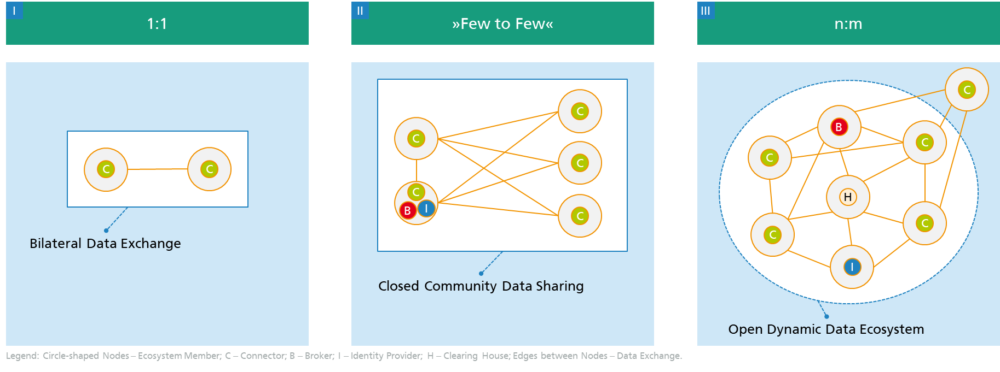

# How To Build Data Spaces?
## Introduction
The following content is meant to support everyone who wants to either build IDS components or implement and/or contribute to the existing open source components.
It will link you to relevant sources and will provide guidance on your way. 

The Knowledge Base (a.k.a. "How to Build Data Spaces?") is the store of information that relies on IDS expertise, that is meant to support building IDS components and contribute to the existing open source components. A five-step approach is depicted here to sort the great amount of information and documentation in a structured manner. Each step contains links to the relevant information and resources that might be helpful in the process of establishing data spaces.

Since this documentation relies on the IDS expertise and experience of everyone involved, please feel free **to contribute to it.** 
In case you are unable to locate the information you are looking for, please:
+ Open an issue that points to this topic. 
+ Add a section, link, or whatever that would fill this gap.
+ Have a look at the open issues and try to fix them.

If you are interested in contributing to this document, please check the detailed information on [how to contribute](/how-to-build-data-spaces/CONTRIBUTING.md) to this documentation.

# Building Data Spaces
On the sections below, you will find the appropriate resources and links that provide technical information/documentation on each step for developing data spaces, based on [goals of IDSA](../GOALS.md). As is known, every development journey is an individual one. So your starting point may differ based on your knowledge, as well as the steps you have to take. Please feel free to check the forthcoming chapters to find relevant information and documentation.

In general, a typical data space development journey consists of the following stages. Please feel free to start from any of these steps, based on how familiar you are with IDS Technologies. 

[1. Gather Knowledge](/how-to-build-data-spaces/1-Gather-Knowledge.md)

[2. Define Your Use Case](/how-to-build-data-spaces/2-Define-Your-Use-Case.md)

[3. Build Components](/how-to-build-data-spaces/3-Build-Components.md)

[4. Prepare for Go-Live](/how-to-build-data-spaces/4-Prepare-for-Go-Live.md)

[5. Share](/how-to-build-data-spaces/5-Share.md)

# Looking for Best Practices?
Currently, IDS does not yet have an overarching existing ecosystem. Until now, mainly use cases between individual companies have been addressed
In the following diagram, these are located in evolutionary stage **I**.
In the meantime, use cases of evolution stage **II** are becoming increasingly established. The [Mobility Data Space](https://www.mobility-data-space.de/) and [Catena-X](https://www.handelsblatt.com/27129464.html) are particularly worthy of mention here, as are other [IDS Communities](https://internationaldataspaces.org/make/communities/) and [Projects](https://internationaldataspaces.org/make/projects/).

(Boris Otto, 2020)

On the IDSA website some use cases are described, which can be used as a guideline:
[https://internationaldataspaces.org/make/use-cases-overview/](https://internationaldataspaces.org/make/use-cases-overview/)
