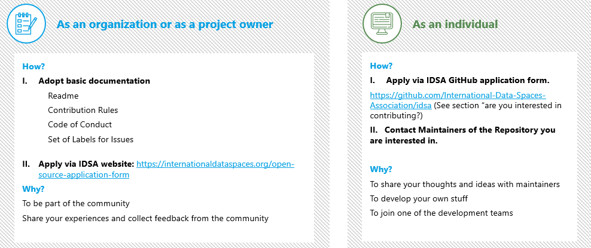

# How to Become a Contributor?



As one of the main pillars of Open Source philosophy is collaboration, it is important to become part of the projects and express your opinion. In IDSA's open source endeavor, we warmly welcome everyone (whether you are a techie or non-techie) to join us and participate in the exchange of thoughts.

Please start by [joining IDS on Github](https://forms.office.com/pages/responsepage.aspx?id=NNZGs\_usx0K9RPFVfuibGz1qA21VHyZEj6dyjHL7iBdUM0ZVMzlEMkJTUlhOSEVEWEQyMjZPOUNYTi4u).

