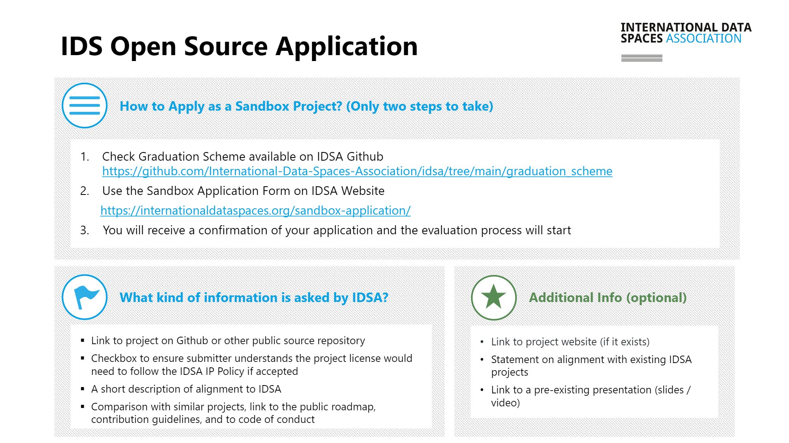

# IDS Graduation Scheme

IDS Graduation Scheme provides a transparent way to assess the maturity of IDS Building Blocks that are available. Current list of projects that are part of IDS Graduation Scheme can be seen [here](../graduation\_scheme/Projects.md).

If you have a IDS project that is not yet part of IDS Graduation Scheme, then we invite you to apply as a sandbox project. You can do this by&#x20;

1\) Checking the [IDS Graduation Scheme](https://github.com/International-Data-Spaces-Association/idsa/tree/main/graduation\_scheme) to see what is needed.&#x20;

2\) Applying via the [sandbox application form](https://internationaldataspaces.org/sandbox-application/) on IDSA website.

Following the submission, our Technical Steering Committee will review your application and you will get the result of this evaluation via email.
