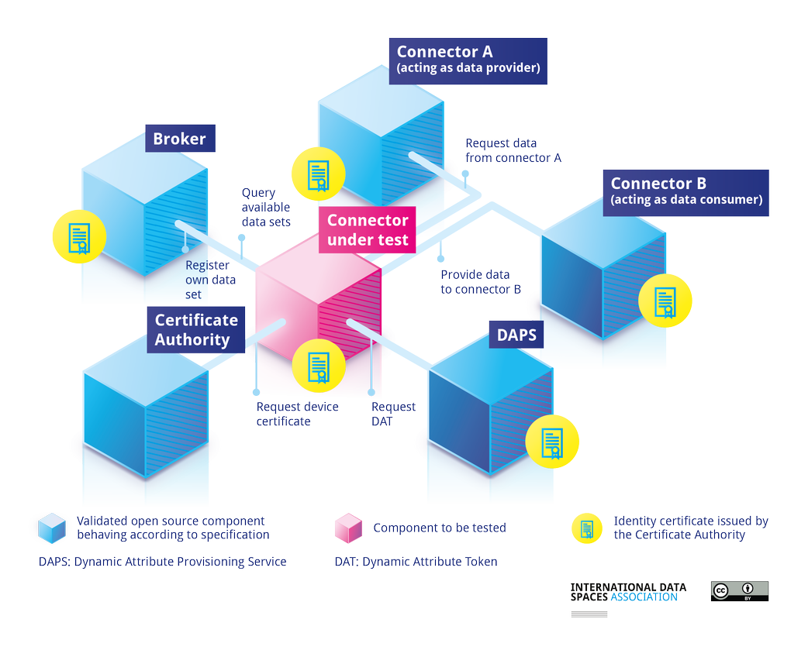

# IDS Reference Testbed

IDS Testbed is a setup with Open Source IDS components which can be used to verify that a component:​

* implements the IDS specifications for establishing connections and communication.​
* and, thus, can work interoperable with all IDS components in the testbed setup.

It can be used for:

* Component behaviour testing
* Interoperability testing against IDS components (Connector, DAPS, CA, Metadata Broker)
* Preparation for IDS certification
* Starting point for creation of data spaces

More information can be found [via this page](https://docs.internationaldataspaces.org/ids-reference-testbed/).
